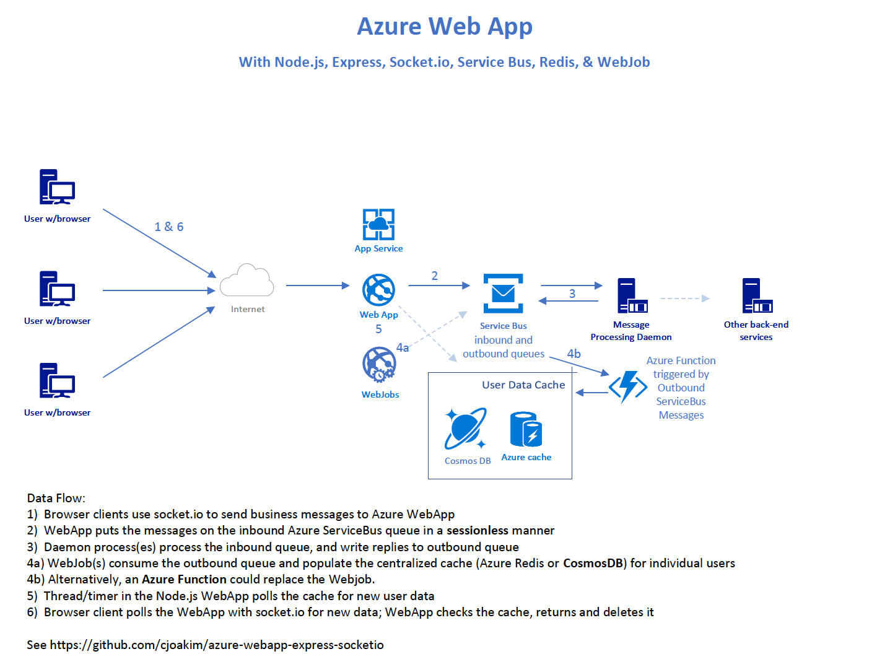

# azure-webapp-express-socketio

## Architecture

## Setup

### Provision and Configure Azure PaaS Services

- Provision an Azure Web App
- Provision an Azure Service Bus, with inbound and outbound queues
- Provision an Azure Redis Cache

### Workstation Setup

- git clone or fork this repo
- cd azure-webapp-express-socketio
- mkdir tmp
- npm install
- set environment variables per your provisioned Azure PaaS services
  - AZURE_SERVICEBUS_NAMESPACE
  - AZURE_SERVICEBUS_QUEUE
  - AZURE_SERVICEBUS_KEY_NAME
  - AZURE_SERVICEBUS_ACCESS_KEY
  - AZURE_REDISCACHE_NAMESPACE
  - AZURE_REDISCACHE_KEY

### Configure Azure PaaS Services

- Setup WebApp deployment to use your (GitHub) source control repository
- Configure WebApp Application Settings per the above AZURE_xxx environment variables

### Run the App on your Workstation

- Start the worker process in one terminal; run: ./worker.sh
- Start the web app in another terminal; run: npm start
  - See log message "Express server listening on port nnnn"
- Visit http://localhost:nnnn/ with your browser, with nnnn the port number like 3000
- Login with any Id, password is 'q'
- Enter message in the text area at bottom of page and click the 'Send' button
- See the message reply several seconds later in the message list
- Rinse and repeat

Screenshot:

